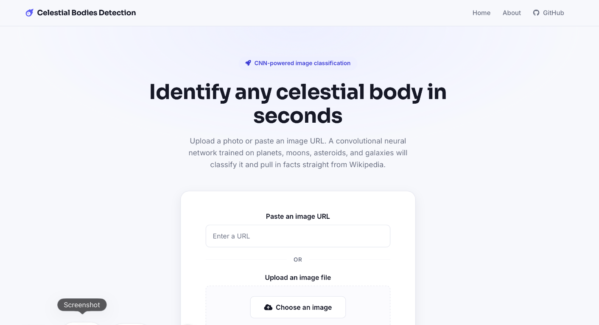
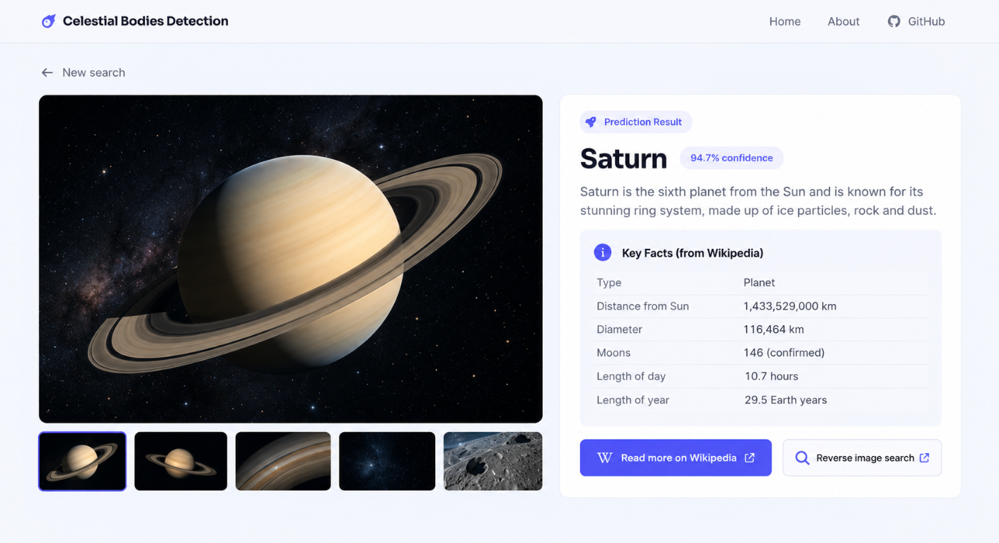
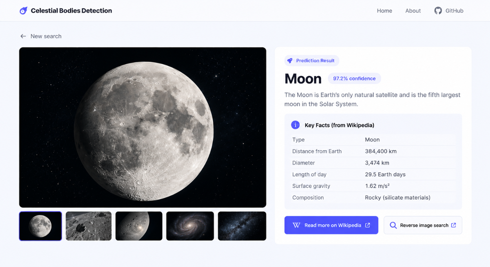
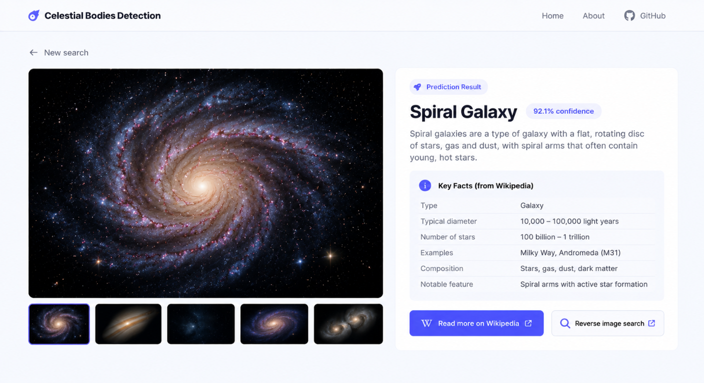

# Celestial Bodies Detection

A Flask web application that uses a Convolutional Neural Network (CNN) to classify images of celestial bodies — planets, moons, asteroids, and galaxies — and returns facts about the predicted object pulled from Wikipedia.

## Screenshots

| Planet (Saturn) | Moon | Spiral Galaxy |
|---|---|---|
|  |  |  |

## Features

- Upload an image or provide a URL to classify a celestial body
- CNN-based image classification (TensorFlow / Keras)
- Prediction confidence scores for every class
- Automatic lookup of relevant facts and statistics from Wikipedia
- Reverse image search shortcut for learning more about the result

## Supported Classes

Asteroids, Earth, Elliptical Galaxy, Jupiter, Mars, Mercury, Moon, Neptune, Saturn, Spiral Galaxy, Uranus, Venus

## Tech Stack

- **Backend:** Flask, Flask-WTF, Flask-Uploads
- **Machine Learning:** TensorFlow, Keras
- **Data:** Wikipedia API, PyYAML

## Project Structure

The web app is built with Flask. Static assets (CSS, JS, images), templates, and the `views.py` route handlers live in the [app/](/Users/kevinmathew/Documents/celestial-objects/CNN-Image-Detection-For-Celestial-Bodies/app) directory.

### Endpoints

| Route | Description |
|---|---|
| `/` | Home page — upload an image or enter a URL |
| `/result` | Displays the classification result, confidence scores, and object facts |
| `/redirectToGoogle` | Redirects to a Google reverse image search |
| `/about` | About the project |

## License

This project is open source and available for educational use.
